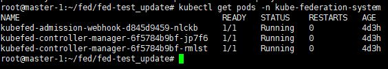

# Federation 설치 가이드

## 개요
- Kubernetes Cluster Federation (KubeFed for short) allows you to coordinate the configuration of multiple Kubernetes clusters from a single set of APIs in a hosting cluster. KubeFed aims to provide mechanisms for expressing which clusters should have their configuration managed and what that configuration should be. The mechanisms that KubeFed provides are intentionally low-level, and intended to be foundational for more complex multicluster use cases such as deploying multi-geo applications and disaster recovery.

## 구성 요소 및 버전
* federation verion: v0.3.0 구축 요망

## 폐쇄망 설치 가이드
* 외부 네트워크 통신이 가능한 환경에서 0.presetCN.sh를 이용하여 이미지 및 패키지를 다운로드하여 폐쇄망 환경으로 옮겨준 뒤, 폐쇄망 환경에서 1.2.install-fed-cn.sh 스크립트를 실행
    * 외부 네트워크 환경 스크립트 실행순서
        ```bash
        $ cd manifest
        $ chmod +x *.sh
        $ bash 0.preset-cn.sh
        ```

    * 폐쇄망 설치 스크립트 실행순서
        * 외부 네트워크 환경에서 받은 파일들을 manifest경로 아래 위치시켜야 함
            * img/
            * bin/
            
        * 폐쇄망 설치 스크립트 실행순서
        ```bash
        $ cd manifest
        $ chmod +x *.sh
        $ export REGISTRY={registryIP:PORT}
        $ bash 1.2.install-fed-cn.sh
        ## 1.2.install-fed-cn.sh 수행 후 kubefed-admission-webhook이 기동 완료될때까지 시간이 필요
        ## Deployment(kubefed-admission-webhook), Pod(kubefed-admission-webhook-...)이 Running상태로 바뀌어도
        ## 실제 정상기동에는 시간이 더 필요하므로 Running상태 체크 후 2~3초 후에 다음 command 실행
        $ bash 1.3.install-hypercloud-crd.sh
        ## failed calling webhook발생시 마지막 커맨드를 다시 수행
        ```

* 정상 동작 확인
    ```bash
    $ kubectl get pod -n kube-federation-system
    ```
    

## Install Steps(Open Network)
* Federation 설치
    ```bash
    $ cd manifest
    $ chmod +x *.sh
    $ bash 1.1.install-fed-on.sh
    ## 1.2.install-fed-cn.sh 수행 후 kubefed-admission-webhook이 기동 완료될때까지 시간이 필요
    ## Deployment(kubefed-admission-webhook), Pod(kubefed-admission-webhook-...)이 Running상태로 바뀌어도
    ## 실제 정상기동에는 시간이 더 필요하므로 Running상태 체크 후 2~3초 후에 다음 command 실행
    $ bash 1.3.install-hypercloud-crd.sh
    ## failed calling webhook발생시 마지막 커맨드를 다시 수행
    ```

* 정상 동작 확인
    ```bash
    $ kubectl get pod -n kube-federation-system
    ```
    

## Uninstall Steps
* Federation의 CRD 제거 및 바이너리, yaml등의 리소스 삭제
    ```bash
    $ cd manifest
    $ source version.conf
    $ bash 2.delete-fed.sh
    ```
